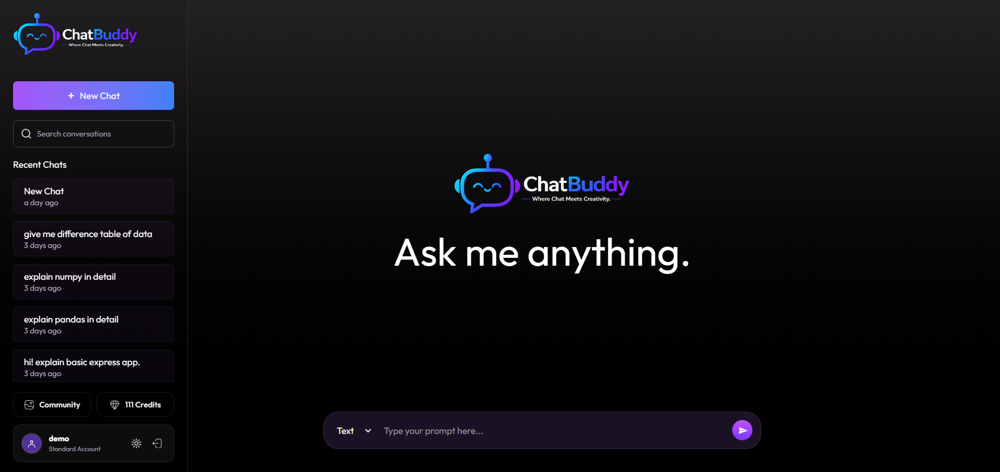
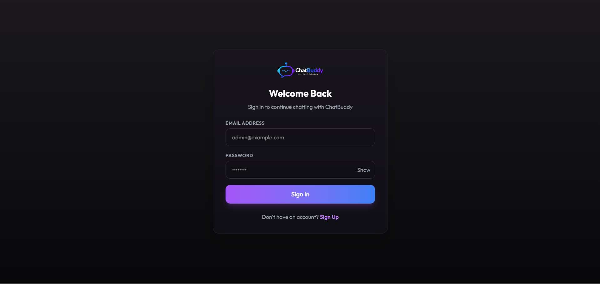
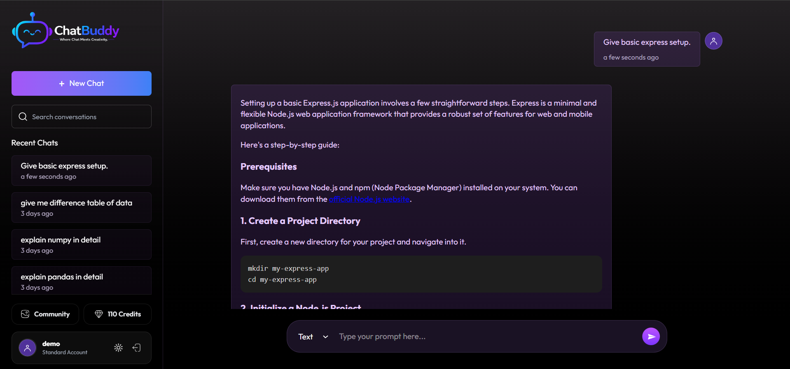
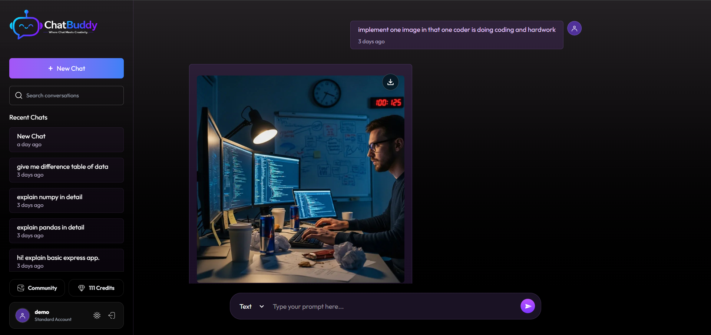
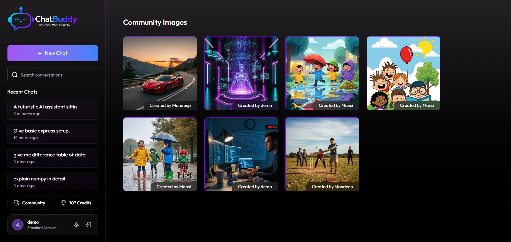
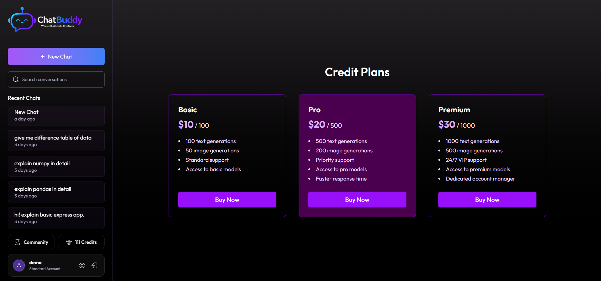

<div align="center">


# 💬 ChatBuddy

### Chat with AI. Create with AI. Share with the world.

A full-stack AI platform — AI chat, AI image generation, a community gallery, and Stripe-powered credits, all in one product.

[](https://react.dev/)
[](https://nodejs.org/)
[](https://www.mongodb.com/)
[](https://expressjs.com/)
[](https://jwt.io/)
[](https://stripe.com/)
[](https://tailwindcss.com/)
[](https://ai.google.dev/)
[](https://imagekit.io/)
[](https://vercel.com/)
[](https://render.com/)

</div>

<br/>

## 📖 Overview

**ChatBuddy** is a full-stack AI application inspired by modern conversational AI platforms.

Instead of focusing only on AI responses, ChatBuddy demonstrates how production-inspired AI applications are built by combining authentication, AI integrations, payments, credit management, persistent conversations, and responsive user experience into one cohesive platform.

The project showcases full-stack engineering concepts including secure authentication, REST APIs, Stripe payment workflows, AI-powered text and image generation, and scalable backend architecture.

<br/>

## 🚀 Live Demo

| Resource | Link |
|---|---|
| 🌐 Website | [chatbuddy-live.vercel.app](https://chatbuddy-live.vercel.app) |
| 🔌 API | [chatbuddy-server.onrender.com](https://chatbuddy-server.onrender.com) |
| 🎥 Demo Video | [Watch here](https://www.linkedin.com/posts/mandeep-p-b44930327_react-nodejs-expressjs-activity-7483860378632814592-76Pf) |

<br/>

### 🚀 Key Highlights

| | | |
|---|---|---|
| 🤖 AI Text Generation | 🎨 AI Image Generation | 💳 Stripe Payments |
| 🪙 Credit System | 🌍 Community Gallery | 🔐 JWT Authentication |
| 📱 Responsive UI | 🌗 Dark Mode | 🔔 Stripe Webhooks |

<br/>

## 📸 Screenshots

<div align="center">

| Landing Page | Login |
|---|---|
|  |  |
| *Modern landing page introducing ChatBuddy* | *JWT-secured authentication* |

| Chat Interface | AI Image Generation |
|---|---|
|  |  |
| *Real-time chat with Markdown rendering* | *Prompt-to-image generation* |

| Community Gallery | Pricing |
|---|---|
|  |  |
| *Published AI images from all users* | *Stripe-backed credit plans* |

</div>

<br/>

## ✨ Features

**Frontend**
- ⚡ React + Vite, styled with Tailwind CSS
- 🌗 Dark mode with persisted preference
- 📱 Fully responsive, mobile-first UI
- ⌨️ Auto-growing prompt box · `Enter` to send · `Shift + Enter` for new line
- 🔄 Loading & AI typing animations

**AI**
- 💬 AI text generation via the Gemini API
- 🎨 AI image generation via ImageKit AI
- 🗂️ Multiple, persistent conversations
- ✍️ Markdown rendering + syntax-highlighted code blocks

**Payments**
- 🪙 Credit-based usage system
- 💳 Stripe Checkout + Stripe Webhooks
- 🧾 Full transaction history

**Backend**
- 🏗️ MVC architecture with REST APIs
- 🔐 JWT authentication & protected routes
- ✅ Joi request validation

**Developer Experience**
- 🌱 Environment-based configuration (dev/prod parity)
- 🧩 Reusable, composable React components
- 🛠️ Centralized error handling & Axios instance

<br/>

## 🛠️ Tech Stack

| Frontend | Backend | Deployment |
|---|---|---|
| React | Node.js | Vercel (Frontend) |
| Vite | Express.js | Render (Backend) |
| Tailwind CSS | MongoDB + Mongoose | MongoDB Atlas |
| React Router | JWT Authentication | |
| Axios | Joi Validation | |
| React Markdown | Stripe | |
| Prism.js | Gemini API | |
| React Hot Toast | ImageKit | |

<br/>

## ⚙️ Installation

**1. Clone the repo**
```bash
git clone https://github.com/yourusername/chatbuddy.git
cd chatbuddy
```

**2. Set up the frontend**
```bash
cd client        # move into the React app
npm install       # install dependencies
npm run dev       # start the Vite dev server
```

**3. Set up the backend** (in a separate terminal)
```bash
cd server         # move into the Express API
npm install        # install dependencies
npm run server         # start the server with nodemon
```

> [!NOTE]
> Add your `.env` files to both `client/` and `server/` **before** running `npm run dev` (see variables below). Frontend runs on `localhost:5173`, backend on `localhost:5000`.

<br/>

## 🔑 Environment Variables

**`client/.env`**

| Variable | Purpose |
|---|---|
| `VITE_SERVER_URL=http://localhost:3000` | Base URL of the backend API |

**`server/.env`**

| Variable | Purpose |
|---|---|
| `MONGODB_URI` | MongoDB Atlas connection string |
| `JWT_SECRET` | Secret used to sign auth tokens |
| `GEMINI_API_KEY` | Auth key for Gemini AI text generation |
| `GEMINI_MODEL` | Gemini AI model for text generation |
| `IMAGEKIT_PUBLIC_KEY` / `IMAGEKIT_PRIVATE_KEY` | ImageKit credentials for AI image generation |
| `IMAGEKIT_URL_ENDPOINT` | ImageKit media delivery endpoint |
| `STRIPE_SECRET_KEY` | Stripe server-side secret key |
| `STRIPE_WEBHOOK_SECRET` | Verifies incoming Stripe webhook events |
| `CLIENT_URL=http://localhost:5173` | Frontend URL, used for CORS & redirects |

<br/>

## 🧠 How It Works

**AI Text Generation**
- User submits a prompt → validated & credit-checked → sent to Gemini API → response saved in MongoDB → rendered in chat

**AI Image Generation**
- User submits an image prompt → sent to ImageKit AI → image uploaded → URL stored → optionally published to the community gallery

**Stripe Payment Flow**
- User selects a plan → Stripe Checkout session created → payment completed → webhook confirms event → credits added to user's account

<br/>

## ⭐ Engineering Highlights

- MVC architecture with clear separation of concerns
- REST APIs designed around resources, not endpoints-as-actions
- JWT authentication with route-level protection
- Joi validation on every mutating request
- Stripe webhooks verified via signature, not trusted blindly
- Fully responsive design, no desktop-only assumptions
- Reusable component architecture on the frontend
- Environment-based config for clean dev/prod separation

<br/>

## 🧗 Challenges Faced

- **Stripe webhooks** — handling asynchronous, out-of-order delivery without double-crediting users
- **AI typing animation** — simulating a natural streaming feel without true token streaming from the API
- **Markdown rendering** — safely rendering AI-generated Markdown + code blocks without breaking layout
- **Credit management** — keeping balance checks race-condition-safe under concurrent requests
- **Image generation workflow** — coordinating prompt → generation → upload → gallery publish as one reliable pipeline

<br/>

## 🔮 Future Improvements

- ⚡ Streaming AI responses
- 🎙️ Voice chat
- 🔗 Chat sharing
- 📌 Pinned chats
- 🔁 Regenerate response
- 📱 PWA support
- 📤 Export chats
- 🌐 Multi-language support

<br/>

## 🎓 Learning Outcomes

- **API Integration** — orchestrating two independent third-party AI providers (Gemini, ImageKit) behind one backend
- **Authentication** — stateless JWT auth with protected routes and password hashing
- **Payments** — Stripe Checkout + webhook-driven fulfillment, including idempotency handling
- **Database Design** — schema design for chat threads, users, and auditable transactions
- **State Management** — managing chat, auth, and theme state cleanly across the client
- **Deployment** — shipping a decoupled frontend/backend to Vercel + Render with environment parity

<br/>

## 👨‍💻 Author

<div align="center">

**Mandeep Parmar**

[](https://github.com/Mandeep-Parmar)
[](https://www.linkedin.com/in/mandeep-p-b44930327/)
[](mailto:mandeeppar07@gmail.com)

⭐ If you found ChatBuddy helpful, consider giving this repository a star!

<sub>Built with ❤️ using React, Node.js, MongoDB, Gemini AI, ImageKit, and Stripe.</sub>

</div>
